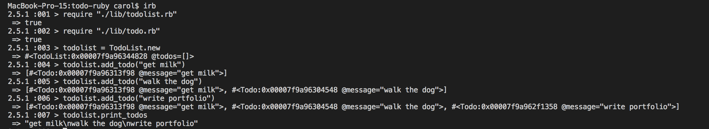

# Todo List 

# Users Stories
```
As a user 
So that I can keep track of my life 
I want to be able to store a list of todos 

As a user 
So that I can plan my day 
I want to be able to print my todos 

As a user 
So I can feel accomplished 
I want to be able to delete my todo when complete
```
# Quick Start
* `git clone https://github.com/CazaBelle/todolist-ruby.git`
* `cd todolist-ruby`
* `bundle install`
* `rspec` #runs tests
* `irb` 
* >>>>>`:001 > require "./lib/todolist.rb"`
* >>>>>`:002 > require "./lib/todo.rb"`

#Demo 

